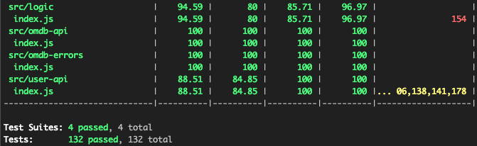
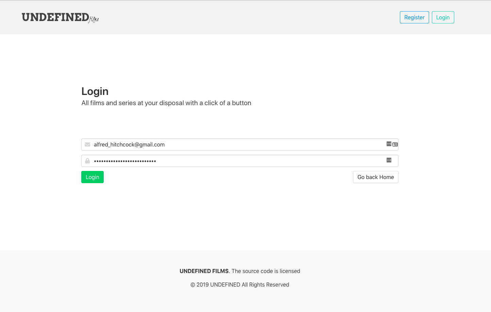
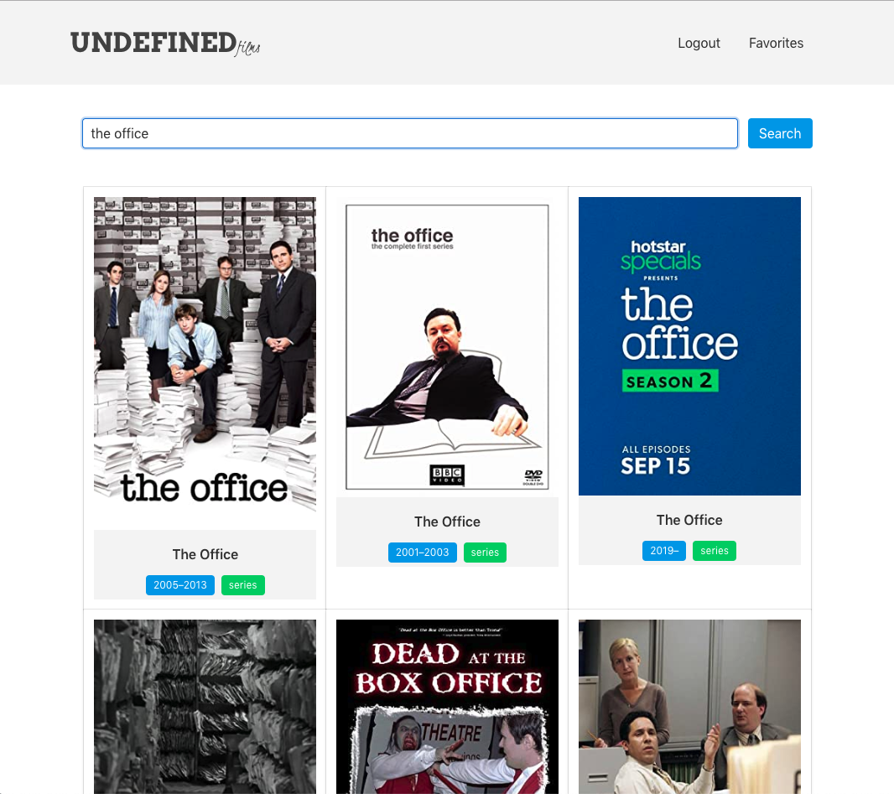
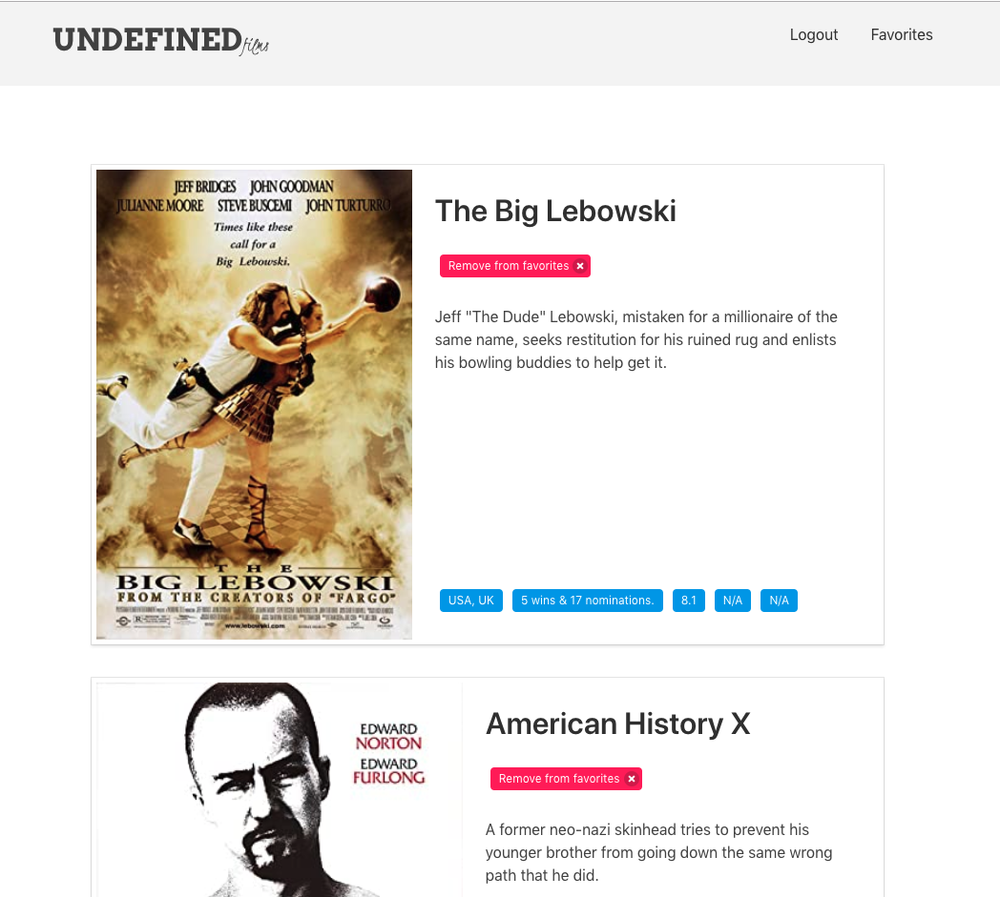
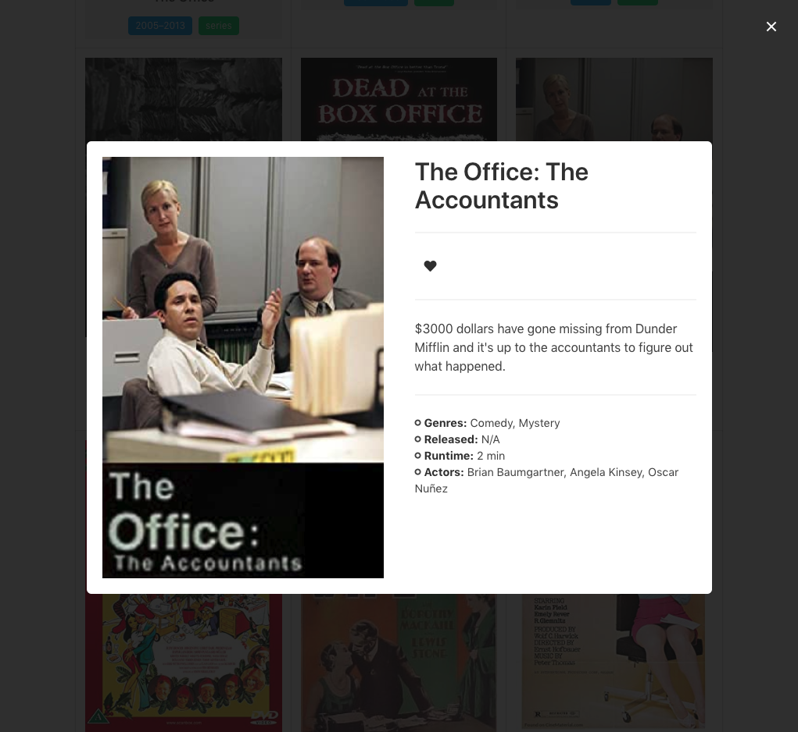

# UNDEFINED FILMS APP

## Introduction

**Undefined films** is a movie and series searcher with over 280,000 items at your disposal. Also, you can manage your favorites movies or series in your favorites panel

[Live Demo](https://nico-undefined.surge.sh/)
the firs load you have to wait because the server are sleeping 😴😴

## Functional Description

### Use Cases

An anonymous user can:
* Register
* Login
* Search for movies and series
* See the details

A logged in user can:
* Register
* Login
* Search for movies and series
* See the details
* Add a movie or serie to your favorites panel

### Flows

#### List Videos

The path starts always with the search functionality. When a user see the detail can add it to your favorites. If the user is not logged will be redirected to the signup page.

## Technical Description

### Blocks

### Components

### Data Model

### Technologies

### Code Coverage

### Project description

